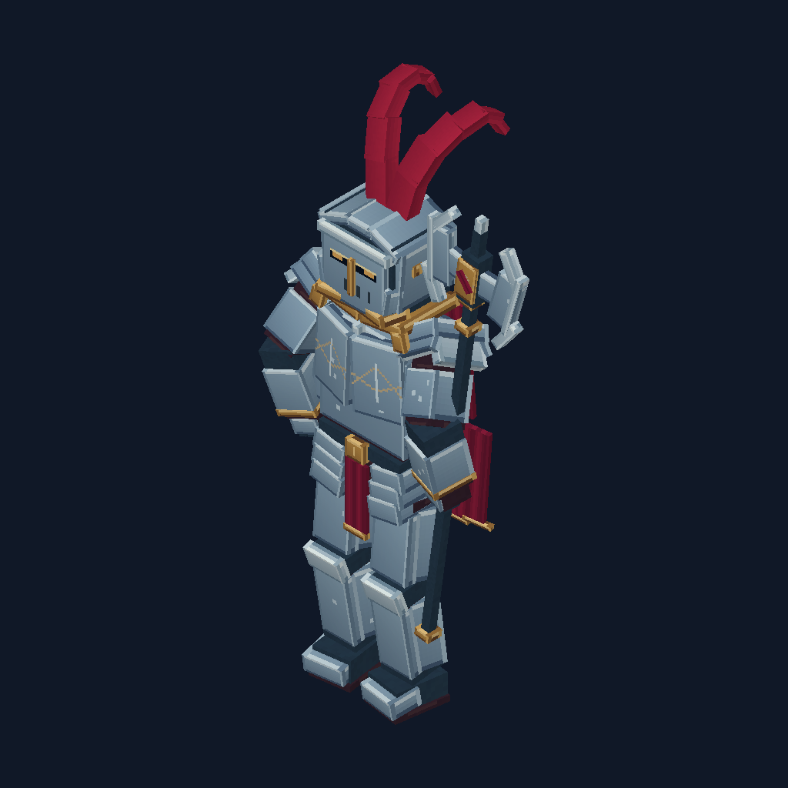
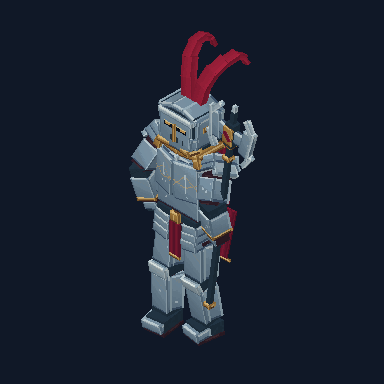

# Crimson Paladin

A silver plate knight with crimson twin crest, folded cape, gold trim and poleaxe. Its authored fixture uses shoulder/chest bevel planes, separate dark joints, a narrower waist, solved limb bends and individually painted face regions.





Open [the native project](../examples/crimson_paladin.bbmodel) as a Generic Model in Blockbench. Textures are embedded. The separate [512x512 atlas](../examples/crimson_paladin_atlas.png) is provided for painting. The 150 cuboids have 900 distinct padded UV regions. Most face dimensions use three texels per unit; north-facing/focal faces use six. Painting includes restrained steel bevel shading, visor slots/vents, breast engraving, crimson folds and a cape emblem. These are deterministic authored pixel patterns, not a hand-painted quality certification.

The rig has 20 groups. `idle`, `walk` and `attack` are baked at 48 samples/second, with exact toe-off keys, into 5706 ordinary numeric keyframes. Native bind pose and initial idle pose agree. Limbs are solved from targets, the right grip follows the independent poleaxe bone, soles cancel leg pitch, and the cape/crest have delayed secondary motion. Attack uses wind-up, a brief supporting grip, swing and recovery. Walk is an in-place clip; gameplay entity movement is external.

## Reproduce

```sh
npm run build
node scripts/generate-paladin.mjs
```

An optional argument selects the output directory; default is `dist/showcase/crimson_paladin`. The trusted authoring script overwrites its named generated files there and does not execute provider code or make network calls. It emits canonical BBIR, embedded `.bbmodel`, PNG atlas, per-face atlas layout, six views, three GIFs, PNG frame sequences with fixed cameras, rig-target samples and a validation record.

Tests independently reconstruct IK endpoints, check packed region texels/padding, decode real GIF frames/delays with a separate library and measure the Paladin's actual hand/foot markers through its hierarchy. Tested key/intermediate samples require grip error below .02 model units, planted ankle height error below .005 and level soles. They check texture density, native roundtrip and bind-pose/idle equivalence. These tolerances describe the fixture, not arbitrary generated models. Live Blockbench import/save/reopen and game runtime behavior have not been verified for this asset.

The software preview has directional light and cutout alpha, without game PBR, shadows or emissive materials. The asset remains an editable Generic Model; use the appropriate target format/plugin for a game export. Art direction and motion should be reviewed separately from compiler validity. The source and atlas use the repository MIT license.
