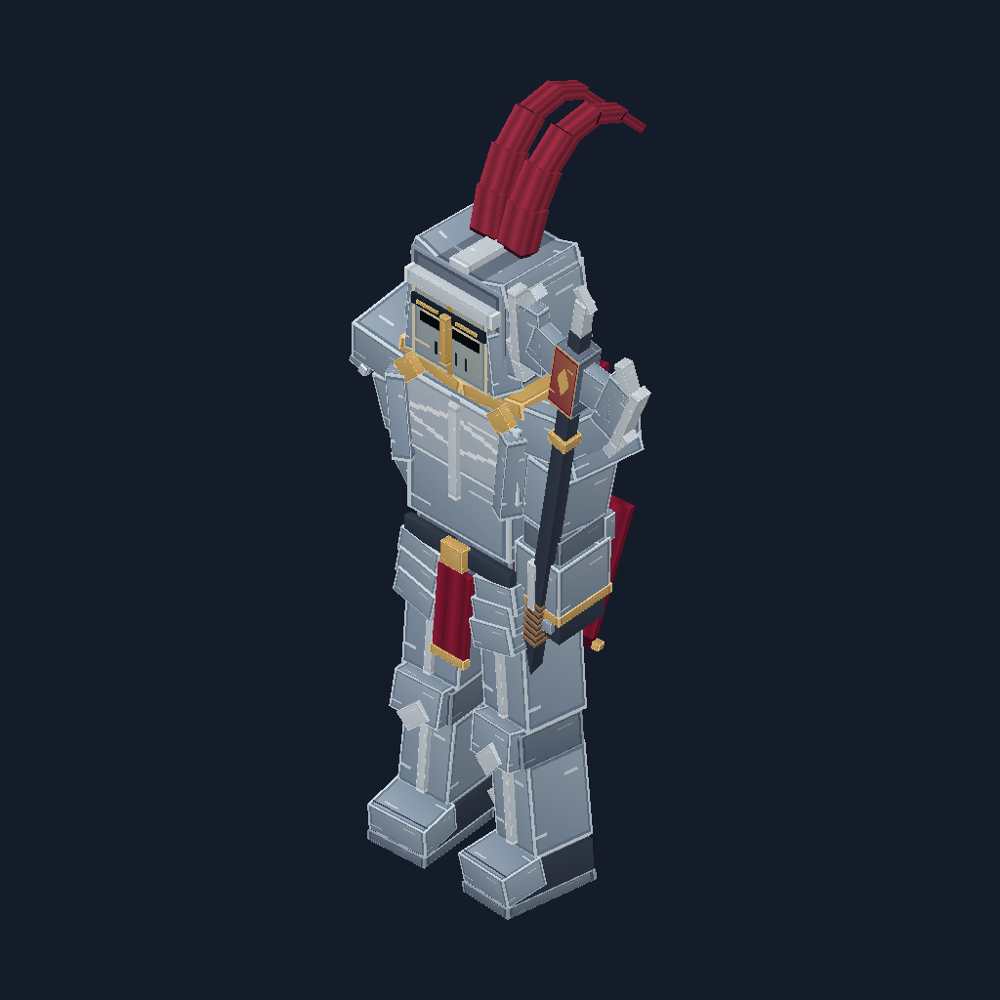

# Crimson Sentinel

A textured medieval knight with silver plate armor, swept twin crimson crest, folded red cape, gold collar/clasps and a double-bladed polearm. Smaller shoulders, a recessed visor, tapered torso and separated feet preserve the character silhouette. Layered plates and dark flexible joints keep the limbs readable.



Open [crimson_sentinel.bbmodel](../examples/crimson_sentinel.bbmodel) directly as a Generic Model in Blockbench. Its 128x128 RGBA atlas is embedded; [the separate PNG](../examples/crimson_sentinel_atlas.png) is supplied for editing. The atlas contains quiet silver/dark-metal regions, crimson fold shading, gold details and dedicated visor, breastplate, cape-emblem and weapon-crest tiles. Faces use explicit tile UVs. Pixel artwork is produced deterministically by the fixture code; no image service is used.

The asset has 148 cuboids and 15 groups. Those counts describe the editable structure, not a visual score. The polearm belongs to the right forearm; helmet/crest, upper cape and cape hem have separate pivots. Numeric clips `idle`, `walk` and `attack` demonstrate rig motion. They are editable animation examples, not a tested combat or locomotion controller.

## Reproduce and review

From a built checkout:

```sh
node scripts/generate-sentinel.mjs
```

Outputs go to `dist/showcase/crimson_sentinel`; one optional argument selects another local directory. The trusted fixture script overwrites its own named outputs there. It writes the native project, canonical BBIR, atlas, six camera views, two pose renders per clip and a validation report. `createSentinel()` also exposes the fixture without file writes. No provider text is executed or network request made.

Automated checks verify deterministic construction, the committed native example's equivalence, complete embedded texture references, valid UVs, static foot contact, native roundtrip and finite animated geometry. All three clips change actual rendered pixels. The standalone release test imports/validates/renders this asset outside the checkout. Front, side, back and animated local views have been inspected.

Live Blockbench import/save/reopen and Minecraft gameplay checks for this asset remain separate host gates. The software preview uses simple directional lighting and opaque/cutout textures. It does not demonstrate game emissive/PBR materials. Use the appropriate editor format/plugin for game export.

The fixture, atlas and source project are distributed under the repository's MIT license.
