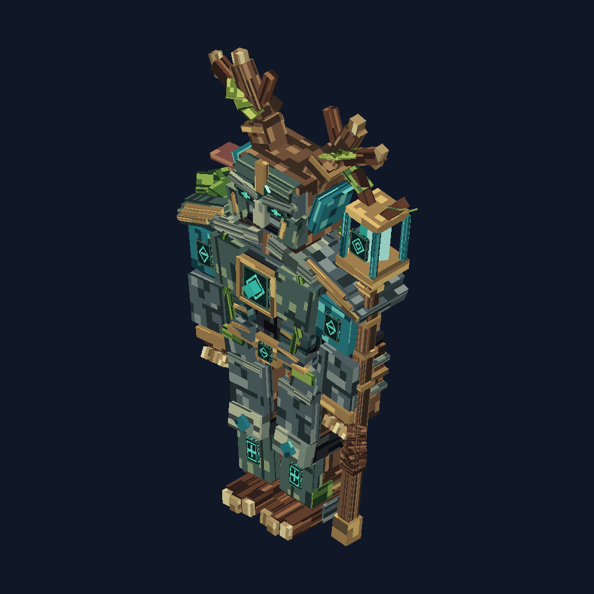

# Elderwood Warden showcase

A textured forest guardian example built with the Formixel BBIR API.

The design combines a branching antler silhouette, angular stone mask with recessed turquoise eyes, layered cuirass and shoulder plates, brass inlays, a rune heart, articulated root hands/feet, moss, mushrooms, a leaf mantle and a crystal lantern staff. It contains **246 cuboids**, **17 groups**, **1,476 textured faces** and three numeric animations: `idle`, `awaken`, `look_around`.



Two original deterministic RGBA pixel atlases are embedded in the `.bbmodel`: `elderwood_surfaces.png` (128 × 128, sixteen surface tiles) and `elderwood_runes.png` (64 × 64, four motifs). Bark has directional grain, stone has cracks/wear, brass has edge accents, leaves have veins/cutout alpha, and runes use bright turquoise. Faces use explicit UV rectangles with approximately two texels per model unit, bounded within their surface tile. Reuse of atlas regions is intentional. These are static textures; bright colours do not imply a game emissive shader.

## Generate

From a built source checkout:

```sh
node scripts/generate-warden.mjs
```

Outputs go to `dist/showcase/elderwood_warden`. A single optional argument chooses the local output directory. This trusted authoring script overwrites its own named generated files there; it is not a provider task, does not evaluate FXL and makes no network/shell calls. It emits the editable native project, canonical BBIR, separate atlases, three views and a validation record.

The published source example is [elderwood_warden.bbmodel](../examples/elderwood_warden.bbmodel). Open it with Blockbench's **File > Open Model**. Texture data is embedded, so moving the `.bbmodel` does not break texture paths. Switch to Animate and select a clip to preview it. Separate PNG copies are provided for editing.

## Executed validation — 2026-10-06

Runtime validation returned zero diagnostics. Export/import canonical BBIR matched exactly, including all texture pixels, UVs, hierarchy and animation tracks. Every face references an existing texture. Independent pose samples and PNG renders change across animation times. The CLI validated the compiled project. Front, three-quarter and back renders were visually inspected.

Actual Blockbench web 5.2.1 loaded the `.bbmodel` with 246 cubes and both named atlases at their correct sizes. Animate mode listed all three clips; `idle` was selected and playback advanced. A screenshot of the textured full model is retained in the local deliverable. The in-app browser did not return a download when Download Archive was clicked; editor save/download/reopen is not counted as completed evidence. The tested workflow is opening the generated embedded project and previewing it. Desktop hosts and game-specific exports remain separate checks.

The source, atlases and generator use the repository's MIT license.
